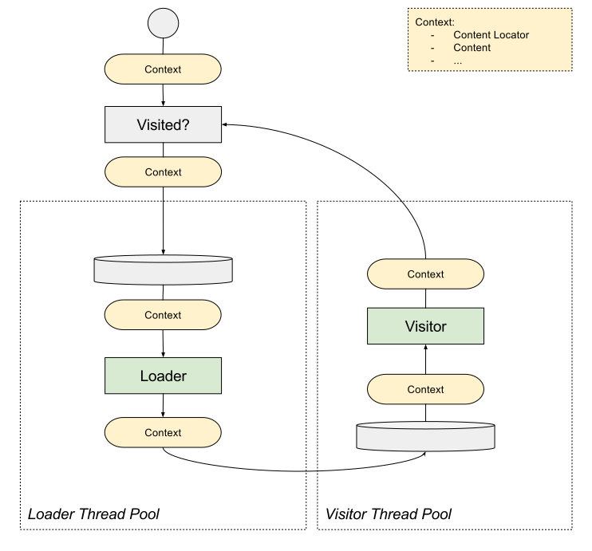

# About
A lightweight threaded web crawler which uses handlers to load content locations and visit content.

# Goals
- Lightweight and simple
- Serve as a base for a configuration based crawler (AKA *not* for writing one off crawlers)
- *Not* enforce content loading policy decisions such as rate limiting, retrying on error, ... (This can be handled by a policy based proxy)
- *Not* a tool for processing extracted items

# Concepts
## Context
A context is used as the primary means of state passing between discover, load, and visit phases.

## Content Locator
The abstraction of a content locator is used to allow for handling of content which requires more than just a HTTP request to load.
For example many javascript only single page web apps require DOM interactions and additional network requests to access content.

# Design
## Threading
Two thread pools are used:
 - ContentLoader: Services content locators. The number of threads allowed in this pool indirectly determines the maximum number of simultaneous connections.
 - ContentVisitor: Services content.

## Diagrams
### Crawl Process

# Wish List
- stats manager which registers to events and, if configured, periodically logs stats
- ability to pause crawl: Stop could let active workers finish and return internal state (ex: discovered set, locator queue, push content back onto locator queue). Start could take this internal state.
- javascript support
- db backed crawler